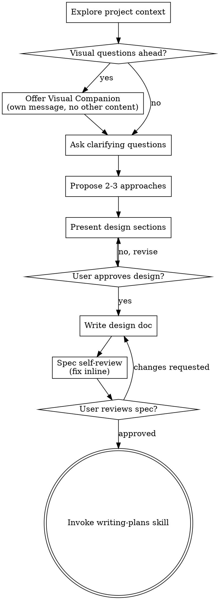

# 将头脑风暴转化为设计

通过自然的协作对话，帮助把想法转化为完整成形的设计和规格。

先理解当前项目上下文，然后一次问一个问题来细化想法。当你理解要构建什么后，展示设计并获得用户批准。

<HARD-GATE>
在你展示设计并且用户批准之前，不要调用任何实现 skill、写任何代码、搭建任何项目，或采取任何实现动作。这适用于每个项目，不管它看起来多简单。
</HARD-GATE>

## 反模式：“这太简单了，不需要设计”

每个项目都要经过这个流程。todo list、单函数工具、配置变更——全都如此。“简单”项目最容易因为未经审视的假设造成最多浪费。设计可以很短（真正简单的项目用几句话即可），但你必须展示它并获得批准。

## Checklist

你必须为以下每一项创建任务，并按顺序完成：

1. **探索项目上下文**——检查文件、文档、近期 commits
2. **提供 visual companion**（如果主题会涉及视觉问题）——这必须是单独一条消息，不能和澄清问题合并。见下方 Visual Companion 部分。
3. **提出澄清问题**——一次一个，理解目的、约束、成功标准
4. **提出 2-3 种方案**——包含权衡和你的建议
5. **展示设计**——按复杂度拆分章节，每节后获得用户批准
6. **编写设计文档**——保存到当前任务的项目根目录或 worktree 根目录下的 `hello-scholar/memory/specs/YYYY-MM-DD-<topic>-design.md` 并 commit
7. **Spec 自审**——快速内联检查占位符、矛盾、歧义、范围（见下方）
8. **用户审阅已写好的 spec**——继续前让用户审阅 spec 文件
9. **转入实现**——调用 writing-plans skill 来创建实现计划

## 流程

**终止状态是调用 writing-plans。** 不要调用 frontend-design、mcp-builder 或任何其他实现 skill。brainstorming 后你唯一调用的 skill 是 writing-plans。

## 流程细节

**理解想法：**

- 先检查当前项目状态（文件、文档、近期 commits）
- 在询问详细问题之前，评估范围：如果请求描述多个独立子系统（例如“构建一个包含聊天、文件存储、计费和分析的平台”），要立即指出。不要把问题花在细化一个本就需要拆解的项目细节上。
- 如果项目太大，不适合单个 spec，帮助用户拆成子项目：哪些是独立部分、它们如何关联、应该按什么顺序构建？然后按正常设计流程对第一个子项目进行 brainstorming。每个子项目都有自己的 spec → plan → implementation cycle。
- 对范围合适的项目，一次问一个问题来细化想法
- 尽可能优先使用多选题，但开放式问题也可以
- 每条消息只问一个问题——如果一个主题需要更多探索，把它拆成多个问题
- 聚焦理解：目的、约束、成功标准

**探索方案：**

- 提出 2-3 种不同方案并说明权衡
- 用对话式方式展示选项，给出你的建议和理由
- 先给出你推荐的选项，并解释原因

**展示设计：**

- 当你确信自己理解要构建什么后，展示设计
- 每节根据复杂度调整长度：简单内容几句话即可，复杂内容最多 200-300 词
- 每节之后询问目前看起来是否正确
- 覆盖：架构、组件、数据流、错误处理、测试
- 如果有内容不清楚，准备回退并澄清

**为隔离和清晰而设计：**

- 把系统拆成更小的单元，每个单元都有明确职责，通过清晰定义的接口通信，并且能独立理解和测试
- 对每个单元，你都应该能回答：它做什么、如何使用它、它依赖什么？
- 不读内部实现，别人能理解一个单元做什么吗？你能改变内部实现而不破坏消费者吗？如果不能，边界需要调整。
- 更小、边界清晰的单元也更便于你工作——你更擅长推理能一次装进上下文的代码，文件聚焦时你的编辑也更可靠。当文件变大时，这通常表明它承担了太多职责。

**在已有代码库中工作：**

- 提出变更前先探索当前结构。遵循已有模式。
- 如果已有代码中的问题会影响这项工作（例如文件变得过大、边界不清、职责纠缠），把有针对性的改进纳入设计——就像优秀开发者会改善自己正在处理的代码。
- 不要提出无关重构。专注于服务当前目标的内容。

## 设计之后

**文档：**

- 将已验证的设计（spec）写入当前任务的项目根目录或 worktree 根目录下的 `hello-scholar/memory/specs/YYYY-MM-DD-<topic>-design.md`
  - （用户对 spec 位置的偏好会覆盖这个默认值）
- 如果可用，使用 elements-of-style:writing-clearly-and-concisely skill
- 将设计文档 commit 到 git

**Spec 自审：**
写完 spec 文档后，用新鲜视角审视它：

1. **占位符扫描：** 是否有 “TBD”、“TODO”、未完成章节或模糊需求？修掉。
2. **内部一致性：** 各章节之间是否矛盾？架构是否匹配功能描述？
3. **范围检查：** 它是否足够聚焦，可以进入单个实现计划，还是需要拆解？
4. **歧义检查：** 是否有需求可能被两种方式理解？如果有，选择一种并明确写出。

内联修复所有问题。不需要重新评审——直接修复并继续。

**用户审阅门：**
spec review loop 通过后，请用户在继续前审阅写好的 spec：

> “Spec 已写入并 commit 到 `<path>`。请审阅该 spec 文件，并告诉我在开始编写实现计划之前是否需要修改。”

等待用户回应。如果他们要求修改，修改后重新运行 spec review loop。只有在用户批准后才继续。

**实现：**

- 调用 writing-plans skill 来创建详细实现计划
- 不要调用任何其他 skill。writing-plans 是下一步。

## 关键原则

- **一次一个问题**——不要用多个问题压倒用户
- **优先多选**——在可行时比开放式问题更容易回答
- **严格 YAGNI**——从所有设计中移除不必要功能
- **探索替代方案**——在确定方案前始终提出 2-3 种方案
- **增量验证**——展示设计，获得批准后再继续
- **保持灵活**——当内容不合理时回退并澄清

## Visual Companion

用于在 brainstorming 期间展示 mockups、diagrams 和 visual options 的浏览器 companion。它是一个工具——不是一种模式。接受 companion 意味着它可以用于适合视觉处理的问题；这并不意味着每个问题都要通过浏览器。

**提供 companion：** 当你预期接下来的问题会涉及视觉内容（mockups、layouts、diagrams）时，先请求一次同意：
> “我们正在处理的部分内容如果能在 web browser 中展示，可能更容易解释。我可以在过程中制作 mockups、diagrams、comparisons 和其他 visuals。这个功能仍然很新，可能会消耗较多 token。想试试吗？（需要打开一个 local URL）”

**这个邀请必须是单独一条消息。** 不要把它和澄清问题、上下文摘要或任何其他内容合并。消息应只包含上面的邀请，不包含其他任何内容。等待用户回应后再继续。如果他们拒绝，就继续纯文本 brainstorming。

**逐问题决策：** 即使用户接受了，也要对每个问题判断使用浏览器还是 terminal。判断标准是：**用户通过看会比通过读更容易理解吗？**

- **使用浏览器**处理视觉内容——mockups、wireframes、layout comparisons、architecture diagrams、side-by-side visual designs
- **使用 terminal**处理文本内容——requirements questions、conceptual choices、tradeoff lists、A/B/C/D text options、scope decisions

关于 UI 主题的问题并不自动等于视觉问题。“在这个上下文中 personality 是什么意思？”是概念问题——使用 terminal。“哪种 wizard layout 更好？”是视觉问题——使用浏览器。

如果他们同意使用 companion，继续前阅读详细指南：
`skills/brainstorming/visual-companion.md`
