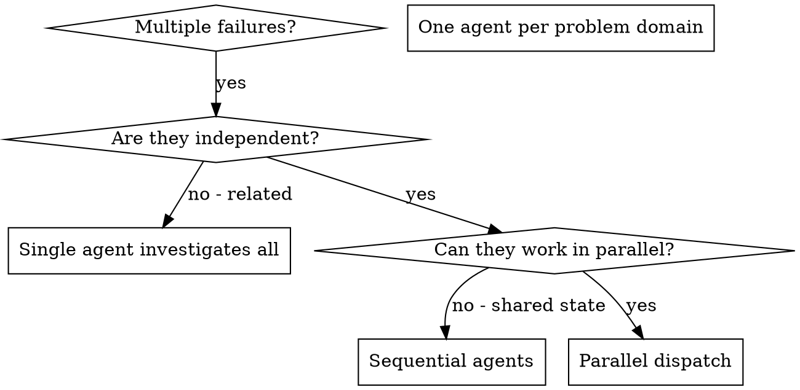

# 调度并行 Agents

## 概览

你将任务委派给拥有隔离上下文的专门 agents。通过精确编写它们的指令和上下文，确保它们保持聚焦并完成任务。它们绝不应继承你的会话上下文或历史——你只构造它们确实需要的内容。这也能保留你自己的上下文用于协调工作。

当你遇到多个无关失败（不同测试文件、不同子系统、不同 bug）时，按顺序调查会浪费时间。每项调查都是独立的，可以并行进行。

**核心原则：** 每个独立问题领域调度一个 agent。让它们并发工作。

## 何时使用



**适用场景：**
- 3+ 个测试文件失败，且根因不同
- 多个子系统彼此独立地坏了
- 每个问题都可以在不依赖其他问题上下文的情况下理解
- 调查之间没有共享状态

**不要使用的场景：**
- 失败彼此相关（修一个可能修好其他）
- 需要理解完整系统状态
- Agents 会互相干扰

## 模式

### 1. 识别独立领域

按损坏内容对失败分组：
- File A tests: Tool approval flow
- File B tests: Batch completion behavior
- File C tests: Abort functionality

每个领域都是独立的——修复 tool approval 不会影响 abort tests。

### 2. 创建聚焦的 Agent 任务

每个 agent 获得：
- **具体范围：** 一个测试文件或子系统
- **清晰目标：** 让这些测试通过
- **约束：** 不要修改其他代码
- **预期输出：** 总结你发现并修复了什么

### 3. 并行调度

```typescript
// In Claude Code / AI environment
Task("Fix agent-tool-abort.test.ts failures")
Task("Fix batch-completion-behavior.test.ts failures")
Task("Fix tool-approval-race-conditions.test.ts failures")
// All three run concurrently
```

### 4. 审阅并整合

Agents 返回后：
- 阅读每份总结
- 验证修复之间没有冲突
- 运行完整 test suite
- 整合所有变更

## Agent Prompt 结构

好的 agent prompts 具有：
1. **聚焦**——一个清晰的问题领域
2. **自包含**——包含理解问题所需的全部上下文
3. **明确输出**——agent 应该返回什么？

```markdown
Fix the 3 failing tests in src/agents/agent-tool-abort.test.ts:

1. "should abort tool with partial output capture" - expects 'interrupted at' in message
2. "should handle mixed completed and aborted tools" - fast tool aborted instead of completed
3. "should properly track pendingToolCount" - expects 3 results but gets 0

These are timing/race condition issues. Your task:

1. Read the test file and understand what each test verifies
2. Identify root cause - timing issues or actual bugs?
3. Fix by:
   - Replacing arbitrary timeouts with event-based waiting
   - Fixing bugs in abort implementation if found
   - Adjusting test expectations if testing changed behavior

Do NOT just increase timeouts - find the real issue.

Return: Summary of what you found and what you fixed.
```

## 常见错误

**❌ 过宽泛：** “Fix all the tests”——agent 会迷失
**✅ 具体：** “Fix agent-tool-abort.test.ts”——范围聚焦

**❌ 没有上下文：** “Fix the race condition”——agent 不知道在哪里
**✅ 有上下文：** 粘贴错误消息和测试名称

**❌ 没有约束：** Agent 可能重构所有东西
**✅ 有约束：** “Do NOT change production code” 或 “Fix tests only”

**❌ 输出模糊：** “Fix it”——你不知道改了什么
**✅ 具体：** “Return summary of root cause and changes”

## 何时不要使用

**相关失败：** 修一个可能修好其他——先一起调查
**需要完整上下文：** 理解问题需要看到整个系统
**探索式调试：** 你还不知道坏在哪里
**共享状态：** Agents 会互相干扰（编辑相同文件、使用相同资源）

## 会话中的真实示例

**场景：** 一次重大重构后，3 个文件中有 6 个测试失败

**失败：**
- agent-tool-abort.test.ts: 3 failures (timing issues)
- batch-completion-behavior.test.ts: 2 failures (tools not executing)
- tool-approval-race-conditions.test.ts: 1 failure (execution count = 0)

**决策：** 独立领域——abort logic、batch completion、race conditions 彼此分离

**调度：**
```
Agent 1 → Fix agent-tool-abort.test.ts
Agent 2 → Fix batch-completion-behavior.test.ts
Agent 3 → Fix tool-approval-race-conditions.test.ts
```

**结果：**
- Agent 1：用 event-based waiting 替换 timeouts
- Agent 2：修复 event structure bug（threadId 在错误位置）
- Agent 3：添加等待 async tool execution 完成

**整合：** 所有修复彼此独立，无冲突，完整 suite 变绿

**节省时间：** 3 个问题并行解决，而不是按顺序解决

## 关键收益

1. **并行化**——多个调查同时发生
2. **聚焦**——每个 agent 范围狭窄，需要追踪的上下文更少
3. **独立性**——Agents 彼此不干扰
4. **速度**——用解决 1 个问题的时间解决 3 个问题

## 验证

Agents 返回后：
1. **审阅每份总结**——理解改了什么
2. **检查冲突**——agents 是否编辑了同一代码？
3. **运行完整 suite**——验证所有修复能一起工作
4. **抽查**——agents 可能犯系统性错误

## 真实世界影响

来自调试会话（2025-10-03）：
- 3 个文件中有 6 个失败
- 3 个 agents 并行调度
- 所有调查并发完成
- 所有修复成功整合
- Agent 变更之间零冲突
