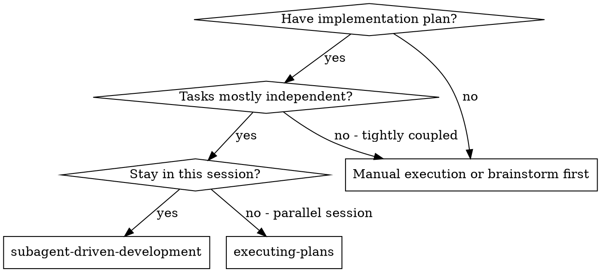
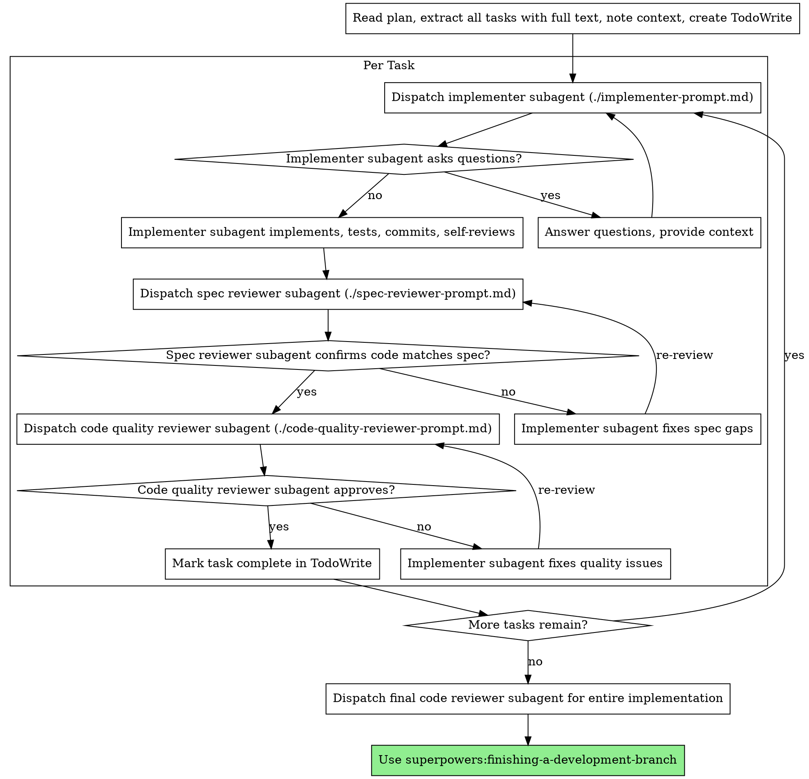

# 子代理驱动开发

通过为每个任务派发全新的子代理来执行计划，并在每个任务之后进行两阶段审查：先审查是否符合规格，再审查代码质量。

**为什么使用子代理：** 你将任务委派给拥有隔离上下文的专门代理。通过精确编写它们的指令和上下文，你可以确保它们保持专注并完成任务。它们绝不应继承你当前会话的上下文或历史记录——你只构造它们真正需要的内容。这也能保留你自己的上下文用于协调工作。

**核心原则：** 每个任务使用全新子代理 + 两阶段审查（先规格后质量）= 高质量、快速迭代

**持续执行：** 不要在任务之间暂停向你的人类伙伴确认。无停顿地执行计划中的所有任务。唯一应停止的原因是：你无法解决的 BLOCKED 状态、确实阻止进展的歧义，或所有任务已完成。“我应该继续吗？”这类提示和进度摘要会浪费他们的时间——他们要求你执行计划，所以就执行它。

## 何时使用



**与 Executing Plans（并行会话）相比：**
- 同一会话（没有上下文切换）
- 每个任务使用全新子代理（没有上下文污染）
- 每个任务后进行两阶段审查：先规格符合性，再代码质量
- 更快迭代（任务之间不需要人类介入）

## 流程



## 模型选择

使用能够胜任每个角色的最低能力模型，以节省成本并提升速度。

**机械实现任务**（隔离函数、清晰规格、1-2 个文件）：使用快速、便宜的模型。计划规格足够明确时，大多数实现任务都是机械性的。

**集成和判断任务**（多文件协调、模式匹配、调试）：使用标准模型。

**架构、设计和审查任务**：使用可用的最强模型。

**任务复杂度信号：**
- 涉及 1-2 个文件且规格完整 → 便宜模型
- 涉及多个文件并有集成关注点 → 标准模型
- 需要设计判断或广泛理解代码库 → 最强模型

## 处理实现者状态

实现者子代理会报告四种状态之一。分别按以下方式处理：

**DONE:** 继续进行规格符合性审查。

**DONE_WITH_CONCERNS:** 实现者完成了工作，但标记了疑虑。继续前先阅读这些疑虑。如果疑虑涉及正确性或范围，先处理再审查。如果只是观察（例如“这个文件变大了”），记录下来并继续审查。

**NEEDS_CONTEXT:** 实现者需要未提供的信息。提供缺失上下文并重新派发。

**BLOCKED:** 实现者无法完成任务。评估阻塞点：
1. 如果是上下文问题，提供更多上下文并使用同一模型重新派发
2. 如果任务需要更多推理，使用更强模型重新派发
3. 如果任务太大，将其拆成更小的部分
4. 如果计划本身错误，升级给人类

**绝不要**忽略升级，也不要在没有变化的情况下强迫同一模型重试。如果实现者说卡住了，就必须改变某些条件。

## Prompt 模板

- `./implementer-prompt.md` - 派发实现者子代理
- `./spec-reviewer-prompt.md` - 派发规格符合性审查子代理
- `./code-quality-reviewer-prompt.md` - 派发代码质量审查子代理

## 示例工作流

```
You: I'm using Subagent-Driven Development to execute this plan.

[Read plan file once: hello-scholar/memory/plans/feature-plan.md]
[Extract all 5 tasks with full text and context]
[Create TodoWrite with all tasks]

Task 1: Hook installation script

[Get Task 1 text and context (already extracted)]
[Dispatch implementation subagent with full task text + context]

Implementer: "Before I begin - should the hook be installed at user or system level?"

You: "User level (~/.config/superpowers/hooks/)"

Implementer: "Got it. Implementing now..."
[Later] Implementer:
  - Implemented install-hook command
  - Added tests, 5/5 passing
  - Self-review: Found I missed --force flag, added it
  - Committed

[Dispatch spec compliance reviewer]
Spec reviewer: ✅ Spec compliant - all requirements met, nothing extra

[Get git SHAs, dispatch code quality reviewer]
Code reviewer: Strengths: Good test coverage, clean. Issues: None. Approved.

[Mark Task 1 complete]

Task 2: Recovery modes

[Get Task 2 text and context (already extracted)]
[Dispatch implementation subagent with full task text + context]

Implementer: [No questions, proceeds]
Implementer:
  - Added verify/repair modes
  - 8/8 tests passing
  - Self-review: All good
  - Committed

[Dispatch spec compliance reviewer]
Spec reviewer: ❌ Issues:
  - Missing: Progress reporting (spec says "report every 100 items")
  - Extra: Added --json flag (not requested)

[Implementer fixes issues]
Implementer: Removed --json flag, added progress reporting

[Spec reviewer reviews again]
Spec reviewer: ✅ Spec compliant now

[Dispatch code quality reviewer]
Code reviewer: Strengths: Solid. Issues (Important): Magic number (100)

[Implementer fixes]
Implementer: Extracted PROGRESS_INTERVAL constant

[Code reviewer reviews again]
Code reviewer: ✅ Approved

[Mark Task 2 complete]

...

[After all tasks]
[Dispatch final code-reviewer]
Final reviewer: All requirements met, ready to merge

Done!
```

## 优势

**相比手动执行：**
- 子代理会自然遵循 TDD
- 每个任务使用全新上下文（没有混乱）
- 并行安全（子代理不会相互干扰）
- 子代理可以提问（工作前和工作中都可以）

**相比 Executing Plans：**
- 同一会话（没有交接）
- 持续推进（无需等待）
- 自动审查检查点

**效率收益：**
- 没有文件读取开销（控制者提供完整文本）
- 控制者精确筛选所需上下文
- 子代理预先获得完整信息
- 问题在工作开始前暴露（而不是之后）

**质量门：**
- 自审会在交接前发现问题
- 两阶段审查：规格符合性，然后代码质量
- 审查循环确保修复确实有效
- 规格符合性防止过度构建或构建不足
- 代码质量确保实现构建良好

**成本：**
- 更多子代理调用（每个任务一个实现者 + 2 个审查者）
- 控制者需要更多准备工作（预先提取所有任务）
- 审查循环会增加迭代
- 但能更早发现问题（比之后调试更便宜）

## 危险信号

**绝不要：**
- 未经用户明确同意就在 main/master 分支上开始实现
- 跳过审查（规格符合性或代码质量）
- 在问题未修复时继续
- 并行派发多个实现子代理（会冲突）
- 让子代理读取计划文件（应直接提供完整文本）
- 跳过场景设定上下文（子代理需要理解任务的位置）
- 忽略子代理问题（先回答，再让它们继续）
- 在规格符合性上接受“差不多”（规格审查者发现问题 = 未完成）
- 跳过审查循环（审查者发现问题 = 实现者修复 = 再次审查）
- 让实现者自审替代真正的审查（两者都需要）
- **在规格符合性为 ✅ 之前开始代码质量审查**（顺序错误）
- 任一审查仍有开放问题时进入下一个任务

**如果子代理提问：**
- 清晰、完整地回答
- 如有需要，提供额外上下文
- 不要催促它们进入实现

**如果审查者发现问题：**
- 实现者（同一个子代理）修复问题
- 审查者再次审查
- 重复直到批准
- 不要跳过重新审查

**如果子代理任务失败：**
- 派发修复子代理并给出具体指令
- 不要手动修复（会污染上下文）

## 集成

**必需工作流技能：**
- **superpowers:using-git-worktrees** - 确保隔离工作区（创建一个或验证已存在）
- **superpowers:writing-plans** - 创建此技能要执行的计划
- **superpowers:requesting-code-review** - 审查子代理的代码审查模板
- **superpowers:finishing-a-development-branch** - 所有任务完成后收尾开发

**子代理应使用：**
- **superpowers:test-driven-development** - 子代理为每个任务遵循 TDD

**替代工作流：**
- **superpowers:executing-plans** - 用于并行会话，而不是同一会话执行
