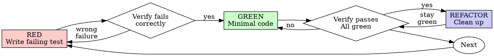

# 测试驱动开发（TDD）

## 概述

先写测试。看它失败。再写最小代码让它通过。

**核心原则：** 如果你没有亲眼看到测试失败，就不知道它是否测试了正确的东西。

**违背规则的字面要求，就是违背规则精神。**

## 何时使用

**始终使用：**
- 新功能
- Bug 修复
- 重构
- 行为变更

**例外（询问你的人类伙伴）：**
- 一次性原型
- 生成代码
- 配置文件

想着“这次就跳过 TDD”？停止。这是合理化借口。

## 铁律

```
NO PRODUCTION CODE WITHOUT A FAILING TEST FIRST
```

先写代码再写测试？删除它。重新开始。

**没有例外：**
- 不要把它保留为“参考”
- 不要在写测试时“改编”它
- 不要看它
- 删除就是删除

从测试出发重新实现。句号。

## Red-Green-Refactor



### RED - 编写失败测试

编写一个最小测试，展示应该发生什么。

<Good>
```typescript
test('retries failed operations 3 times', async () => {
  let attempts = 0;
  const operation = () => {
    attempts++;
    if (attempts < 3) throw new Error('fail');
    return 'success';
  };

  const result = await retryOperation(operation);

  expect(result).toBe('success');
  expect(attempts).toBe(3);
});
```
名称清晰，测试真实行为，只测试一件事
</Good>

<Bad>
```typescript
test('retry works', async () => {
  const mock = jest.fn()
    .mockRejectedValueOnce(new Error())
    .mockRejectedValueOnce(new Error())
    .mockResolvedValueOnce('success');
  await retryOperation(mock);
  expect(mock).toHaveBeenCalledTimes(3);
});
```
名称模糊，测试 mock 而不是代码
</Bad>

**要求：**
- 一个行为
- 清晰名称
- 真实代码（除非不可避免，否则不要 mock）

### 验证 RED - 看它失败

**强制要求。绝不跳过。**

```bash
npm test path/to/test.test.ts
```

确认：
- 测试失败（不是报错）
- 失败消息符合预期
- 失败是因为功能缺失（不是拼写错误）

**测试通过？** 你在测试已有行为。修正测试。

**测试报错？** 修正错误，重新运行，直到它以正确方式失败。

### GREEN - 最小代码

编写能让测试通过的最简单代码。

<Good>
```typescript
async function retryOperation<T>(fn: () => Promise<T>): Promise<T> {
  for (let i = 0; i < 3; i++) {
    try {
      return await fn();
    } catch (e) {
      if (i === 2) throw e;
    }
  }
  throw new Error('unreachable');
}
```
刚好足以通过
</Good>

<Bad>
```typescript
async function retryOperation<T>(
  fn: () => Promise<T>,
  options?: {
    maxRetries?: number;
    backoff?: 'linear' | 'exponential';
    onRetry?: (attempt: number) => void;
  }
): Promise<T> {
  // YAGNI
}
```
过度工程化
</Bad>

不要添加功能、重构其他代码，或做超出测试范围的“改进”。

### 验证 GREEN - 看它通过

**强制要求。**

```bash
npm test path/to/test.test.ts
```

确认：
- 测试通过
- 其他测试仍然通过
- 输出干净（无错误、警告）

**测试失败？** 修代码，不要修测试。

**其他测试失败？** 现在就修。

### REFACTOR - 清理

只在 green 之后：
- 删除重复
- 改善命名
- 提取 helper

保持测试绿色。不要添加行为。

### 重复

为下一个功能编写下一个失败测试。

## 好测试

| 质量 | 好 | 坏 |
|---------|------|-----|
| **Minimal** | 一件事。名称里有 “and”？拆开它。 | `test('validates email and domain and whitespace')` |
| **Clear** | 名称描述行为 | `test('test1')` |
| **Shows intent** | 展示期望的 API | 掩盖代码应做什么 |

## 为什么顺序重要

**“我之后会写测试来验证它能工作”**

代码之后写的测试会立即通过。立即通过什么也证明不了：
- 可能测试了错误的东西
- 可能测试的是实现，而不是行为
- 可能漏掉你忘记的边界情况
- 你从未看到它抓住 bug

测试优先会强迫你看到测试失败，证明它确实在测试某些东西。

**“我已经手动测试了所有边界情况”**

手动测试是临时性的。你以为自己测了所有东西，但：
- 没有测试记录
- 代码改变后无法重新运行
- 压力下容易忘记用例
- “我试的时候可以” ≠ 全面

自动化测试是系统化的。它们每次都以同样方式运行。

**“删除 X 小时的工作是浪费”**

沉没成本谬误。时间已经花掉了。你现在的选择是：
- 删除并用 TDD 重写（再花 X 小时，高信心）
- 保留它并事后补测试（30 分钟，低信心，很可能有 bug）

真正的“浪费”是保留你无法信任的代码。没有真实测试的工作代码就是技术债。

**“TDD 是教条，务实就要灵活适配”**

TDD 就是务实：
- 在提交前发现 bug（比事后调试更快）
- 防止回归（测试会立即捕捉破坏）
- 记录行为（测试展示如何使用代码）
- 支持重构（自由修改，测试捕捉破坏）

“务实”捷径 = 在生产中调试 = 更慢。

**“事后测试也能达到同样目标——重在精神，不是仪式”**

不。事后测试回答“这做了什么？”测试优先回答“这应该做什么？”

事后测试会被你的实现偏置。你测试的是你构建的东西，而不是需求。你验证的是记得的边界情况，而不是发现的边界情况。

测试优先会迫使你在实现前发现边界情况。事后测试验证你是否记住了一切（你没有）。

30 分钟事后测试 ≠ TDD。你获得覆盖率，但失去测试确实有效的证明。

## 常见合理化借口

| 借口 | 现实 |
|--------|---------|
| “太简单，不需要测试” | 简单代码也会坏。测试只要 30 秒。 |
| “我之后会测” | 立即通过的测试什么也证明不了。 |
| “事后测试达到同样目标” | 事后测试 = “这做了什么？”测试优先 = “这应该做什么？” |
| “已经手动测试过” | 临时性 ≠ 系统化。没有记录，无法重新运行。 |
| “删除 X 小时很浪费” | 沉没成本谬误。保留未经验证的代码是技术债。 |
| “保留为参考，先写测试” | 你会改编它。那就是事后测试。删除就是删除。 |
| “需要先探索” | 可以。丢弃探索代码，从 TDD 开始。 |
| “测试很难 = 设计不清晰” | 听测试的。难测试 = 难使用。 |
| “TDD 会拖慢我” | TDD 比调试更快。务实 = 测试优先。 |
| “手动测试更快” | 手动无法证明边界情况。每次变更你都要重测。 |
| “现有代码没有测试” | 你正在改善它。为现有代码添加测试。 |

## 危险信号 - 停止并重新开始

- 测试前写代码
- 实现后补测试
- 测试立即通过
- 无法解释测试为何失败
- “之后”添加测试
- 合理化“就这一次”
- “我已经手动测试过”
- “事后测试达到相同目的”
- “重在精神，不是仪式”
- “保留为参考”或“改编已有代码”
- “已经花了 X 小时，删除是浪费”
- “TDD 是教条，我是在务实”
- “这次情况不同，因为……”

**所有这些都意味着：删除代码。从 TDD 重新开始。**

## 示例：Bug 修复

**Bug:** 接受了空 email

**RED**
```typescript
test('rejects empty email', async () => {
  const result = await submitForm({ email: '' });
  expect(result.error).toBe('Email required');
});
```

**验证 RED**
```bash
$ npm test
FAIL: expected 'Email required', got undefined
```

**GREEN**
```typescript
function submitForm(data: FormData) {
  if (!data.email?.trim()) {
    return { error: 'Email required' };
  }
  // ...
}
```

**验证 GREEN**
```bash
$ npm test
PASS
```

**REFACTOR**
如有需要，为多个字段提取验证逻辑。

## 验证清单

在标记工作完成前：

- [ ] 每个新函数/方法都有测试
- [ ] 在实现前看过每个测试失败
- [ ] 每个测试都因预期原因失败（功能缺失，而不是拼写错误）
- [ ] 编写了能通过每个测试的最小代码
- [ ] 所有测试通过
- [ ] 输出干净（无错误、警告）
- [ ] 测试使用真实代码（只有不可避免时才 mock）
- [ ] 覆盖边界情况和错误

无法勾选所有项？你跳过了 TDD。重新开始。

## 卡住时

| 问题 | 解决方案 |
|---------|----------|
| 不知道如何测试 | 写出期望的 API。先写断言。询问你的人类伙伴。 |
| 测试太复杂 | 设计太复杂。简化接口。 |
| 必须 mock 一切 | 代码耦合过高。使用依赖注入。 |
| 测试设置巨大 | 提取 helper。仍然复杂？简化设计。 |

## 调试集成

发现 bug？编写能复现它的失败测试。遵循 TDD 循环。测试证明修复并防止回归。

绝不要在没有测试的情况下修 bug。

## 测试反模式

添加 mock 或测试工具时，阅读 @testing-anti-patterns.md 以避免常见陷阱：
- 测试 mock 行为，而不是真实行为
- 向生产类添加仅测试使用的方法
- 在不了解依赖的情况下 mock

## 最终规则

```
Production code → test exists and failed first
Otherwise → not TDD
```

未经你的人类伙伴许可，没有例外。
