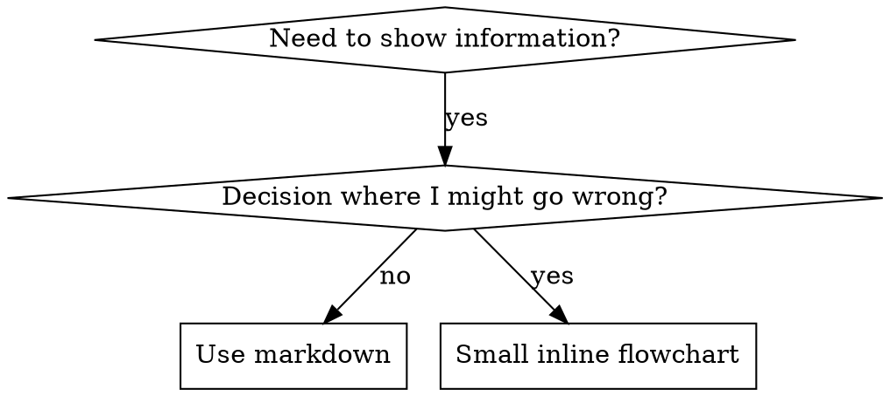

# 编写技能

## 概览

**编写 skill 就是把测试驱动开发应用到流程文档。**

**个人 skill 位于 agent 专用目录（Claude Code 使用 `~/.claude/skills`，Codex 使用 `~/.agents/skills/`）** 

你编写测试用例（用 subagent 做压力场景），观察它们失败（基线行为），编写 skill（文档），观察测试通过（agent 遵守），然后重构（堵住漏洞）。

**核心原则：** 如果你没有观察到 agent 在没有 skill 时失败，你就不知道这个 skill 是否教对了东西。

**必需背景：** 使用此 skill 前，你必须理解 superpowers:test-driven-development。该 skill 定义了基础的 RED-GREEN-REFACTOR 循环。本 skill 将 TDD 适配到文档。

**官方指南：** Anthropic 官方的 skill 编写最佳实践见 anthropic-best-practices.md。本文档提供额外模式和指南，用来补充本 skill 中以 TDD 为中心的方法。

## 什么是 Skill？

**Skill** 是经过验证的技术、模式或工具的参考指南。Skill 帮助未来的 Claude 实例找到并应用有效方法。

**Skill 是：** 可复用技术、模式、工具、参考指南

**Skill 不是：** 关于你曾经如何解决某个问题的叙事

## Skill 的 TDD 映射

| TDD 概念 | Skill 创建 |
|-------------|----------------|
| **测试用例** | 使用 subagent 的压力场景 |
| **生产代码** | Skill 文档（SKILL.md） |
| **测试失败（RED）** | 没有 skill 时 agent 违反规则（基线） |
| **测试通过（GREEN）** | 有 skill 时 agent 遵守 |
| **重构** | 在保持遵守的同时堵住漏洞 |
| **先写测试** | 写 skill 前先运行基线场景 |
| **观察它失败** | 记录 agent 使用的精确合理化话术 |
| **最小代码** | 编写只处理这些具体违规的 skill |
| **观察它通过** | 验证 agent 现在遵守 |
| **重构循环** | 发现新合理化 → 堵住 → 重新验证 |

整个 skill 创建流程遵循 RED-GREEN-REFACTOR。

## 何时创建 Skill

**在以下情况创建：**
- 技术对你来说不是直觉显然的
- 你会在多个项目中再次引用它
- 模式适用范围广（不是项目特定）
- 其他人会受益

**不要为以下情况创建：**
- 一次性解决方案
- 已在别处充分记录的标准实践
- 项目特定约定（放进 CLAUDE.md）
- 机械约束（如果可以用 regex/validation 强制，就自动化；把文档留给需要判断的地方）

## Skill 类型

### 技术
有步骤可遵循的具体方法（condition-based-waiting、root-cause-tracing）

### 模式
思考问题的方式（flatten-with-flags、test-invariants）

### 参考
API 文档、语法指南、工具文档（office docs）

## 目录结构


```
skills/
  skill-name/
    SKILL.md              # Main reference (required)
    supporting-file.*     # Only if needed
```

**扁平命名空间** - 所有 skill 在一个可搜索命名空间中

**以下内容使用单独文件：**
1. **重型参考**（100+ 行）- API 文档、全面语法
2. **可复用工具** - 脚本、实用工具、模板

**以下内容保持内联：**
- 原则和概念
- 代码模式（< 50 行）
- 其他所有内容

## SKILL.md 结构

**Frontmatter（YAML）：**
- 两个必需字段：`name` 和 `description`（所有支持字段见 [agentskills.io/specification](https://agentskills.io/specification)）
- 总计最多 1024 个字符
- `name`：只使用字母、数字和连字符（不要使用括号、特殊字符）
- `description`：第三人称，只描述何时使用（不是它做什么）
  - 以 "Use when..." 开头，聚焦触发条件
  - 包含具体症状、情境和上下文
  - **绝不要总结 skill 的过程或工作流**（原因见 CSO 章节）
  - 如可行，保持在 500 字符以内

```markdown
---
name: Skill-Name-With-Hyphens
description: Use when [specific triggering conditions and symptoms]
---

# Skill Name

## Overview
What is this? Core principle in 1-2 sentences.

## When to Use
[Small inline flowchart IF decision non-obvious]

Bullet list with SYMPTOMS and use cases
When NOT to use

## Core Pattern (for techniques/patterns)
Before/after code comparison

## Quick Reference
Table or bullets for scanning common operations

## Implementation
Inline code for simple patterns
Link to file for heavy reference or reusable tools

## Common Mistakes
What goes wrong + fixes

## Real-World Impact (optional)
Concrete results
```


## Claude 搜索优化（CSO）

**对发现很关键：** 未来的 Claude 需要找到你的 skill

### 1. 丰富的 Description 字段

**目的：** Claude 读取 description 来决定对于给定任务应加载哪些 skill。让它回答："Should I read this skill right now?"

**格式：** 以 "Use when..." 开头，聚焦触发条件

**关键：Description = 何时使用，而不是 Skill 做什么**

Description 应当只描述触发条件。不要在 description 中总结 skill 的过程或工作流。

**为什么这很重要：** 测试发现，当 description 总结 skill 工作流时，Claude 可能会按照 description 行动，而不是阅读完整 skill 内容。一个写着 "code review between tasks" 的 description 导致 Claude 只做了一次 review，尽管 skill 的 flowchart 明确展示了两次 review（规格合规，然后代码质量）。

当 description 改成只写 "Use when executing implementation plans with independent tasks"（不总结工作流）后，Claude 正确阅读了 flowchart，并遵循了两阶段 review 流程。

**陷阱：** 总结工作流的 description 会创建 Claude 会走的捷径。Skill 正文会变成 Claude 跳过的文档。

```yaml
# ❌ BAD: Summarizes workflow - Claude may follow this instead of reading skill
description: Use when executing plans - dispatches subagent per task with code review between tasks

# ❌ BAD: Too much process detail
description: Use for TDD - write test first, watch it fail, write minimal code, refactor

# ✅ GOOD: Just triggering conditions, no workflow summary
description: Use when executing implementation plans with independent tasks in the current session

# ✅ GOOD: Triggering conditions only
description: Use when implementing any feature or bugfix, before writing implementation code
```

**内容：**
- 使用具体触发器、症状和情境，表明此 skill 适用
- 描述*问题*（race conditions、inconsistent behavior），不要描述*语言特定症状*（setTimeout、sleep）
- 除非 skill 本身是技术特定的，否则保持触发器技术无关
- 如果 skill 是技术特定的，在触发器中明确说明
- 使用第三人称书写（会注入系统提示）
- **绝不要总结 skill 的过程或工作流**

```yaml
# ❌ BAD: Too abstract, vague, doesn't include when to use
description: For async testing

# ❌ BAD: First person
description: I can help you with async tests when they're flaky

# ❌ BAD: Mentions technology but skill isn't specific to it
description: Use when tests use setTimeout/sleep and are flaky

# ✅ GOOD: Starts with "Use when", describes problem, no workflow
description: Use when tests have race conditions, timing dependencies, or pass/fail inconsistently

# ✅ GOOD: Technology-specific skill with explicit trigger
description: Use when using React Router and handling authentication redirects
```

### 2. 关键词覆盖

使用 Claude 会搜索的词：
- 错误消息："Hook timed out"、"ENOTEMPTY"、"race condition"
- 症状："flaky"、"hanging"、"zombie"、"pollution"
- 同义词："timeout/hang/freeze"、"cleanup/teardown/afterEach"
- 工具：实际命令、库名、文件类型

### 3. 描述性命名

**使用主动语态，动词优先：**
- ✅ `creating-skills` not `skill-creation`
- ✅ `condition-based-waiting` not `async-test-helpers`

### 4. Token 效率（关键）

**问题：** getting-started 和频繁引用的 skill 会加载进每一次对话。每个 token 都很重要。

**目标字数：**
- getting-started 工作流：每个 <150 词
- 频繁加载的 skill：总计 <200 词
- 其他 skill：<500 词（仍需简洁）

**技巧：**

**把细节移到工具帮助中：**
```bash
# ❌ BAD: Document all flags in SKILL.md
search-conversations supports --text, --both, --after DATE, --before DATE, --limit N

# ✅ GOOD: Reference --help
search-conversations supports multiple modes and filters. Run --help for details.
```

**使用交叉引用：**
```markdown
# ❌ BAD: Repeat workflow details
When searching, dispatch subagent with template...
[20 lines of repeated instructions]

# ✅ GOOD: Reference other skill
Always use subagents (50-100x context savings). REQUIRED: Use [other-skill-name] for workflow.
```

**压缩示例：**
```markdown
# ❌ BAD: Verbose example (42 words)
your human partner: "How did we handle authentication errors in React Router before?"
You: I'll search past conversations for React Router authentication patterns.
[Dispatch subagent with search query: "React Router authentication error handling 401"]

# ✅ GOOD: Minimal example (20 words)
Partner: "How did we handle auth errors in React Router?"
You: Searching...
[Dispatch subagent → synthesis]
```

**消除冗余：**
- 不要重复交叉引用的 skill 中已有的内容
- 不要解释命令本身已经显而易见的内容
- 不要包含同一模式的多个示例

**验证：**
```bash
wc -w skills/path/SKILL.md
# getting-started workflows: aim for <150 each
# Other frequently-loaded: aim for <200 total
```

**按你做什么或核心洞见命名：**
- ✅ `condition-based-waiting` > `async-test-helpers`
- ✅ `using-skills` not `skill-usage`
- ✅ `flatten-with-flags` > `data-structure-refactoring`
- ✅ `root-cause-tracing` > `debugging-techniques`

**动名词（-ing）很适合流程：**
- `creating-skills`、`testing-skills`、`debugging-with-logs`
- 主动，描述你正在采取的动作

### 4. 交叉引用其他 Skill

**编写引用其他 skill 的文档时：**

只使用 skill 名称，并带显式要求标记：
- ✅ 好：`**REQUIRED SUB-SKILL:** Use superpowers:test-driven-development`
- ✅ 好：`**REQUIRED BACKGROUND:** You MUST understand superpowers:systematic-debugging`
- ❌ 差：`See skills/testing/test-driven-development`（不清楚是否必需）
- ❌ 差：`@skills/testing/test-driven-development/SKILL.md`（强制加载，浪费上下文）

**为什么不用 @ 链接：** `@` 语法会立即强制加载文件，在需要之前就消耗 200k+ 上下文。

## Flowchart 使用



**只在以下情况使用 flowchart：**
- 非显然决策点
- 你可能过早停止的流程循环
- "When to use A vs B" 决策

**绝不要为以下内容使用 flowchart：**
- 参考材料 → 表格、列表
- 代码示例 → Markdown 块
- 线性说明 → 编号列表
- 没有语义含义的标签（step1、helper2）

Graphviz 风格规则见 @graphviz-conventions.dot。

**给你的人类伙伴可视化：** 使用本目录中的 `render-graphs.js` 将 skill 的 flowchart 渲染为 SVG：
```bash
./render-graphs.js ../some-skill           # Each diagram separately
./render-graphs.js ../some-skill --combine # All diagrams in one SVG
```

## 代码示例

**一个优秀示例胜过多个平庸示例**

选择最相关的语言：
- 测试技术 → TypeScript/JavaScript
- 系统调试 → Shell/Python
- 数据处理 → Python

**好示例：**
- 完整且可运行
- 注释良好，解释为什么
- 来自真实场景
- 清晰展示模式
- 可直接适配（不是通用模板）

**不要：**
- 用 5+ 种语言实现
- 创建填空式模板
- 编写牵强示例

你擅长移植，一个出色示例足够了。

## 文件组织

### 自包含 Skill
```
defense-in-depth/
  SKILL.md    # Everything inline
```
何时使用：所有内容都能放下，不需要重型参考

### 带可复用工具的 Skill
```
condition-based-waiting/
  SKILL.md    # Overview + patterns
  example.ts  # Working helpers to adapt
```
何时使用：工具是可复用代码，而不只是叙事

### 带重型参考的 Skill
```
pptx/
  SKILL.md       # Overview + workflows
  pptxgenjs.md   # 600 lines API reference
  ooxml.md       # 500 lines XML structure
  scripts/       # Executable tools
```
何时使用：参考材料太大，不适合内联

## 铁律（与 TDD 相同）

```
NO SKILL WITHOUT A FAILING TEST FIRST
```

这适用于新 skill，也适用于编辑现有 skill。

先写 skill 再测试？删掉它。重新开始。
未测试就编辑 skill？同样违规。

**没有例外：**
- 不因为 "simple additions" 例外
- 不因为 "just adding a section" 例外
- 不因为 "documentation updates" 例外
- 不要把未经测试的变更保留为 "reference"
- 不要一边运行测试一边 "adapt"
- 删除就是删除

**必需背景：** superpowers:test-driven-development skill 解释了为什么这很重要。同样原则适用于文档。

## 测试所有 Skill 类型

不同 skill 类型需要不同测试方法：

### 强制纪律的 Skill（规则/要求）

**示例：** TDD、verification-before-completion、designing-before-coding

**测试方式：**
- 学术问题：它们是否理解规则？
- 压力场景：它们在压力下是否遵守？
- 多种压力组合：时间 + 沉没成本 + 权威 + 疲惫
- 识别合理化，并添加明确反制

**成功标准：** Agent 在最大压力下仍遵守规则

### 技术 Skill（how-to 指南）

**示例：** condition-based-waiting、root-cause-tracing、defensive-programming

**测试方式：**
- 应用场景：它们能否正确应用技术？
- 变体场景：它们是否处理边界情况？
- 缺失信息测试：说明中是否有缺口？

**成功标准：** Agent 成功把技术应用到新场景

### 模式 Skill（心智模型）

**示例：** reducing-complexity、information-hiding concepts

**测试方式：**
- 识别场景：它们是否识别何时适用该模式？
- 应用场景：它们能否使用该心智模型？
- 反例：它们是否知道何时不适用？

**成功标准：** Agent 正确识别何时/如何应用模式

### 参考 Skill（文档/API）

**示例：** API documentation、command references、library guides

**测试方式：**
- 检索场景：它们能否找到正确信息？
- 应用场景：它们能否正确使用找到的信息？
- 缺口测试：是否覆盖常见用例？

**成功标准：** Agent 找到并正确应用参考信息

## 跳过测试的常见合理化

| 借口 | 现实 |
|--------|---------|
| "Skill is obviously clear" | Clear to you ≠ clear to other agents. Test it. |
| "It's just a reference" | References can have gaps, unclear sections. Test retrieval. |
| "Testing is overkill" | Untested skills have issues. Always. 15 min testing saves hours. |
| "I'll test if problems emerge" | Problems = agents can't use skill. Test BEFORE deploying. |
| "Too tedious to test" | Testing is less tedious than debugging bad skill in production. |
| "I'm confident it's good" | Overconfidence guarantees issues. Test anyway. |
| "Academic review is enough" | Reading ≠ using. Test application scenarios. |
| "No time to test" | Deploying untested skill wastes more time fixing it later. |

**所有这些都意味着：部署前先测试。没有例外。**

## 让 Skill 抵抗合理化

强制纪律的 skill（如 TDD）需要抵抗合理化。Agent 很聪明，在压力下会找到漏洞。

**心理学说明：** 理解说服技术为什么有效，有助于你系统应用它们。关于权威、承诺、稀缺性、社会认同和统一性原则的研究基础（Cialdini, 2021; Meincke et al., 2025），见 persuasion-principles.md。

### 显式堵住每个漏洞

不要只是陈述规则，要禁止具体绕法：

<Bad>
```markdown
Write code before test? Delete it.
```
</Bad>

<Good>
```markdown
Write code before test? Delete it. Start over.

**No exceptions:**
- Don't keep it as "reference"
- Don't "adapt" it while writing tests
- Don't look at it
- Delete means delete
```
</Good>

### 处理 "Spirit vs Letter" 争辩

尽早添加基础原则：

```markdown
**Violating the letter of the rules is violating the spirit of the rules.**
```

这会切断一整类 "I'm following the spirit" 合理化。

### 构建合理化表

从基线测试中捕获合理化（见下面的 Testing 章节）。Agent 提出的每个借口都放进表格：

```markdown
| Excuse | Reality |
|--------|---------|
| "Too simple to test" | Simple code breaks. Test takes 30 seconds. |
| "I'll test after" | Tests passing immediately prove nothing. |
| "Tests after achieve same goals" | Tests-after = "what does this do?" Tests-first = "what should this do?" |
```

### 创建红旗列表

让 agent 在合理化时容易自检：

```markdown
## Red Flags - STOP and Start Over

- Code before test
- "I already manually tested it"
- "Tests after achieve the same purpose"
- "It's about spirit not ritual"
- "This is different because..."

**All of these mean: Delete code. Start over with TDD.**
```

### 为违规症状更新 CSO

把你即将违反规则时的症状加到 description：

```yaml
description: use when implementing any feature or bugfix, before writing implementation code
```

## Skill 的 RED-GREEN-REFACTOR

遵循 TDD 循环：

### RED：编写失败测试（基线）

在没有 skill 的情况下，用 subagent 运行压力场景。记录精确行为：
- 它们做了哪些选择？
- 它们使用了哪些合理化（逐字记录）？
- 哪些压力触发了违规？

这就是 "watch the test fail"，你必须先看到 agent 在写 skill 前自然会怎么做。

### GREEN：编写最小 Skill

编写处理这些具体合理化的 skill。不要为假设情况添加额外内容。

在有 skill 的情况下运行相同场景。Agent 现在应当遵守。

### REFACTOR：堵住漏洞

Agent 找到新的合理化？添加明确反制。重新测试，直到坚固可靠。

**测试方法：** 完整测试方法见 @testing-skills-with-subagents.md：
- 如何编写压力场景
- 压力类型（time、sunk cost、authority、exhaustion）
- 系统性堵洞
- 元测试技术

## 反模式

### ❌ 叙事示例
"In session 2025-10-03, we found empty projectDir caused..."
**为什么差：** 太具体，不可复用

### ❌ 多语言稀释
example-js.js, example-py.py, example-go.go
**为什么差：** 质量平庸，维护负担

### ❌ Flowchart 中的代码
```dot
step1 [label="import fs"];
step2 [label="read file"];
```
**为什么差：** 不能复制粘贴，难读

### ❌ 泛型标签
helper1, helper2, step3, pattern4
**为什么差：** 标签应当有语义含义

## 停止：进入下一个 Skill 前

**写完任何 skill 后，你都必须停止并完成部署流程。**

**不要：**
- 不逐个测试就批量创建多个 skill
- 当前 skill 验证前就进入下一个 skill
- 因为 "batching is more efficient" 而跳过测试

**下面的部署 checklist 对每个 skill 都是强制性的。**

部署未经测试的 skill = 部署未经测试的代码。这违反质量标准。

## Skill 创建 Checklist（TDD 适配版）

**重要：使用 TodoWrite 为下面每个 checklist 项创建 todos。**

**RED 阶段 - 编写失败测试：**
- [ ] 创建压力场景（纪律型 skill 使用 3+ 个组合压力）
- [ ] 在没有 skill 的情况下运行场景 - 逐字记录基线行为
- [ ] 识别合理化/失败中的模式

**GREEN 阶段 - 编写最小 Skill：**
- [ ] 名称只使用字母、数字、连字符（不要使用括号/特殊字符）
- [ ] YAML frontmatter 包含必需的 `name` 和 `description` 字段（最多 1024 字符；见 [spec](https://agentskills.io/specification)）
- [ ] Description 以 "Use when..." 开头，并包含具体触发器/症状
- [ ] Description 使用第三人称
- [ ] 全文包含用于搜索的关键词（错误、症状、工具）
- [ ] 清晰概览，包含核心原则
- [ ] 处理 RED 中识别出的具体基线失败
- [ ] 代码内联，或链接到单独文件
- [ ] 一个优秀示例（不要多语言）
- [ ] 在有 skill 的情况下运行场景 - 验证 agent 现在遵守

**REFACTOR 阶段 - 堵住漏洞：**
- [ ] 识别测试中出现的新合理化
- [ ] 添加明确反制（如果是纪律型 skill）
- [ ] 从所有测试迭代中构建合理化表
- [ ] 创建红旗列表
- [ ] 重新测试，直到坚固可靠

**质量检查：**
- [ ] 只有在决策非显然时才使用小型 flowchart
- [ ] Quick reference 表
- [ ] Common mistakes 章节
- [ ] 没有叙事故事
- [ ] 支持文件只用于工具或重型参考

**部署：**
- [ ] 将 skill commit 到 git，并 push 到你的 fork（如果已配置）
- [ ] 考虑通过 PR 贡献回去（如果广泛有用）

## 发现工作流

未来的 Claude 如何找到你的 skill：

1. **遇到问题**（"tests are flaky"）
3. **找到 SKILL**（description 匹配）
4. **扫描概览**（这是否相关？）
5. **阅读模式**（quick reference 表）
6. **加载示例**（只有在实现时）

**为这个流程优化** - 早而频繁地放入可搜索术语。

## 底线

**创建 skill 就是流程文档的 TDD。**

同一条铁律：没有失败测试，就没有 skill。
同一个循环：RED（基线）→ GREEN（编写 skill）→ REFACTOR（堵住漏洞）。
同样的收益：质量更好、意外更少、结果坚固可靠。

如果你对代码遵循 TDD，也要对 skill 遵循它。这是同一纪律在文档上的应用。
